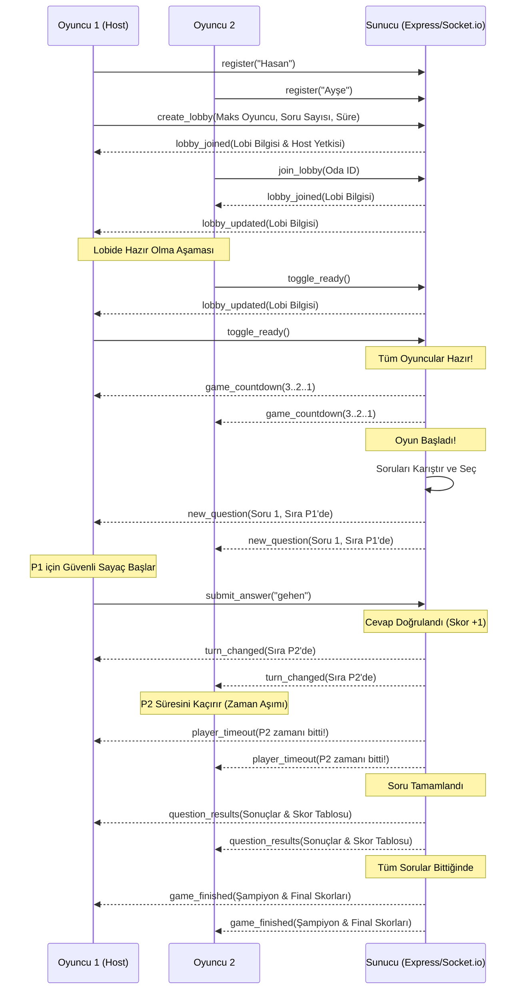

# 🎮 Almanca Fiil Kart Oyunu - Sistem ve Klasör Analizi

Bu detaylı analiz belgesi, **Almanca Fiil Kart Oyunu** (German Verb Card Game) projesinin klasör yapısını, sistem mimarisini, teknik özelliklerini, modüllerini ve çalışma mekanizmalarını açıklamak amacıyla hazırlanmıştır.

---

## 📌 1. Proje Hakkında Genel Bilgi

**Almanca Fiil Kart Oyunu**, Almanca fiillerin Türkçe anlamlarını eğlenceli ve interaktif bir şekilde öğretmeyi hedefleyen modern bir web uygulamasıdır. Proje, tek bir cihazda oynanabilen **Lokal (Offline) Mod** ve internet üzerinden çoklu oyuncu desteği sunan **Online (Multiplayer) Mod** olmak üzere iki temel çalışma yapısına sahiptir.

### 🛠️ Teknolojik Altyapı
* **Frontend (İstemci):** Vanilla HTML5, CSS3 (Grid & Flexbox), Modern JavaScript (ES6+ Web Sockets / Client-side Logic)
* **Backend (Sunucu):** Node.js, Express.js (Statik Dosya Sunumu ve API altyapısı)
* **Real-time İletişim:** Socket.io (Çift yönlü, düşük gecikmeli WebSocket iletişimi)
* **Mobil Entegrasyon:** Progressive Web App (PWA) standartları (Service Worker, Manifest, Adaptive/Maskable Icons) ve PWABuilder / Cordova uyumlu APK altyapısı.

---

## 📂 2. Klasör ve Dosya Yapısı Analizi

Proje, istemci-sunucu (Client-Server) mimarisine uygun şekilde yapılandırılmıştır. Root (kök) dizin sunucu tarafını ve genel proje ayarlarını içerirken, `/mobil` alt klasörü tamamen istemci tarafı (PWA & Mobil Uygulama) kodlarını barındırmaktadır.

### Dizin Ağacı (Directory Tree)

```text
almanca-multiplayer-oyun-main/
│
├── .cursor/                       # Geliştirici editör ayarları ve yönergeler
├── node_modules/                  # Node.js bağımlılık kitaplıkları (Express, Socket.io vb.)
│
├── mobil/                         # 📱 İSTEMCİ (FRONTEND) KLASÖRÜ
│   ├── .idea/                     # Editör çalışma alanı dosyaları
│   ├── icon-*.svg & .png          # PWA ve Android uyumlu maskeli/standart ikonlar
│   ├── index.html                 # 🏠 Lokal (Offline) Mod Ana Ekranı
│   ├── style.css                  # Lokal Mod Stil Dosyası
│   ├── script.js                  # Lokal Mod Oyun ve Arayüz Mantığı
│   ├── multiplayer.html           # 🌐 Online (Multiplayer) Oyun Ekranı
│   ├── style-multiplayer.css      # Online Mod Stil ve Arayüz Tasarımı
│   ├── multiplayer.js             # Online Mod Socket.io İstemci Mantığı
│   ├── sorular.json               # 📊 Almanca Kelime Soru Bankası (500+ Fiil)
│   ├── manifest.json              # PWA Uygulama Tanımlama Protokolü
│   ├── sw.js                      # Service Worker (Offline önbellekleme mekanizması)
│   ├── build-apk.bat              # Mobil APK derleme rehber betiği
│   ├── convert-icons.bat          # SVG ikonları PNG formatına dönüştürme aracı
│   ├── start-server.bat           # Lokal test sunucusu başlatma betiği
│   └── README.md                  # Mobil uygulama özel rehberi
│
├── package.json                   # Proje bağımlılıkları ve çalıştırma komutları
├── package-lock.json              # Kilitli bağımlılık ağacı versiyonları
├── server.js                      # 🌐 SUNUCU (BACKEND) - Node.js Express & Socket.io
├── sorular.json                   # Kök dizin soru yedek dosyası
├── start-multiplayer.bat          # Windows için tek tıkla oyunu ve sunucuyu başlatma betiği
├── start-multiplayer.sh           # Linux/macOS için başlatma betiği
├── script.js                      # Kök dizin lokal istemci yedeği
├── style.css                      # Kök dizin lokal stil yedeği
└── README.md                      # Proje ana tanıtım ve kurulum belgesi
```

### Önemli Dosyaların Görev Tanımları

| Dosya Adı | Konum | Tür | Görevi ve Sorumluluğu |
| :--- | :--- | :--- | :--- |
| **`server.js`** | Root | Backend | Node.js Express sunucusu. İstemci dosyalarını statik olarak sunar. `Socket.io` ile oda yönetimi, oyuncu senkronizasyonu, soru havuzu kontrolü ve oyun döngüsü state'lerini (bekleme, geri sayım, aktif oyun, final) yönetir. |
| **`sorular.json`** | `/mobil` | Veri | Almanca-Türkçe soru bankası. Her soru bir nesne olup benzersiz ID, Türkçe kelime, doğru Almanca karşılığı ve 4 şıklı seçenekler içerir. |
| **`multiplayer.html`** | `/mobil` | Frontend | Çok oyunculu modun arayüzüdür. Giriş, lobi arama/oluşturma, lobi bekleme ekranı, oyun alanı, sohbet (chat) kutusu ve oyun sonu liderlik ekranını barındırır. |
| **`multiplayer.js`** | `/mobil` | İstemci Mantığı | Sunucu ile WebSocket bağlantısını kuran, ekran geçişlerini yöneten, buton durumlarını güncelleyen ve güvenli bağımsız geri sayım sayaçlarını kontrol eden ana istemci kodudur. |
| **`index.html`** | `/mobil` | Frontend | Aynı cihaz üzerinden sırayla (Pass & Play) oynanan lokal mod arayüzüdür. İnternet bağlantısı gerektirmez. |
| **`sw.js`** | `/mobil` | PWA Sistemi | Service Worker dosyası. Uygulamanın offline (çevrimdışı) çalışabilmesi için gerekli olan statik kaynakları önbelleğe alır ve performansı artırır. |
| **`manifest.json`** | `/mobil` | PWA Sistemi | Mobil cihazların tarayıcı üzerinden uygulamayı telefona yüklemesini sağlayan, splash screen renklerini ve adaptive ikonları tanımlayan PWA yapılandırma dosyasıdır. |

---

## ⚙️ 3. Sistem Mimarisi ve Modüller

Uygulama, **Merkezi Sunucu Tabanlı Çok Oyunculu Durum Makinesi (Centralized Server-State Machine)** mimarisine göre çalışır. Güvenlik ve senkronizasyon gereği oyun durumları (skorlar, doğru cevaplar, süreler) asla istemci tarafında tutulmaz; sunucu her zaman tek doğruluk kaynağıdır (Single Source of Truth).

### 🔄 Sistem Çalışma Döngüsü (Mermaid Akış Şeması)



### 📦 Temel Modüller

#### 1. Çok Oyunculu Oda (Lobby) Yönetim Modülü (`server.js` - `Lobby` Sınıfı)
* **Oda Oluşturma/Katılma:** Rastgele UUID'ler ile odalar oluşturulur.
* **Oyuncu Takibi:** Lobilere dinamik olarak oyuncu eklenir, çıkarılır. Eğer lobi kurucusu (Host) oyundan çıkarsa, oda otomatik olarak lobi sırasındaki ilk oyuncuya devredilir (`removePlayer` & `hostId` transfer mantığı).
* **Hazırlık Sistemi (`toggle_ready`):** Oyuncuların hazır durumlarını doğrular. Tüm oyuncular hazır olmadan oyun başlatılamaz.

#### 2. Güvenli Zaman ve Turn Kontrol Modülü
* **Sıra Tabanlı Oynanış:** Sorular tüm oyunculara aynı anda sunulurken, sadece sırası gelen (`currentPlayerIndex`) oyuncunun cevap vermesine izin verilir. Diğer oyuncuların ekranlarında "Bekleniyor" arayüzü gösterilir ve butonları kilitlenir.
* **Bağımsız ve Güvenli Sayaç Sistemi (`startIndependentTimer`):** Çift tetiklenme veya senkronizasyon kopmalarını engellemek amacıyla, her istemci kendi yerel zaman sayacını sunucudan gelen turn süresine göre bağımsız yönetir. Süre bittiğinde sunucu otomatik olarak oyuncuyu pas geçer (`player_timeout` olayı).

#### 3. Sohbet (Real-Time Chat) Modülü
* Oyun esnasında ve lobide oyuncuların anlık olarak mesajlaşmasını sağlar.
* `send_chat_message` olayı ile gönderilen mesajlar sunucu tarafından filtrelenerek lobiye özel yayınlanır (`io.to(lobbyId).emit('chat_message')`).

#### 4. PWA (Progressive Web App) ve Çevrimdışı Modül
* İnternet bağlantısı kesildiğinde dahi `index.html` üzerinden çalışan çevrimdışı yerel mod aktif olur.
* `sw.js` (Service Worker) arka planda tüm stil ve soru bankası verilerini önbelleğe alarak yükleme hızını milisaniyeler seviyesine çeker.

---

## 🤝 4. İletişim Protokolü: WebSocket Olay Listesi

İstemci ve sunucu arasındaki tüm veri akışı tanımlanmış olaylar (Events) üzerinden gerçekleşir.

### İstemciden Sunucuya Gönderilen Olaylar (Emit)

| Olay Adı | Gönderilen Veri | Açıklama |
| :--- | :--- | :--- |
| `register` | `playerName` (String) | Oyuncuyu sisteme kaydeder ve lobi listesini tetikler. |
| `create_lobby` | `{ maxPlayers, gameSettings }` | Yeni bir oyun lobisi ve ayarlarını oluşturur. |
| `join_lobby` | `lobbyId` (UUID) | Belirtilen lobiye oyuncuyu dahil eder. |
| `leave_lobby` | *(Yok)* | Mevcut lobiden ayrılma isteği gönderir. |
| `toggle_ready` | *(Yok)* | Hazır durumunu (Ready / Not Ready) değiştirir. |
| `update_game_settings` | `{ questionCount, timeLimit }` | Oyun ayarlarını günceller (Sadece Host yapabilir). |
| `submit_answer` | `answer` (String / Seçenek) | Sırası gelen oyuncunun verdiği cevabı değerlendirilmek üzere sunucuya gönderir. |
| `send_chat_message` | `message` (String) | Lobi içi sohbet mesajı gönderir. |

### Sunucudan İstemciye Gönderilen Olaylar (On)

| Olay Adı | Alınan Veri | Açıklama |
| :--- | :--- | :--- |
| `lobbies_updated` | `LobbiesList` (Array) | Aktif odaların durumunu ve oyuncu sayılarını günceller. |
| `lobby_joined` | `LobbyObject` (JSON) | Oyuncunun odaya başarıyla girdiğini onaylar ve ekranı değiştirir. |
| `lobby_updated` | `LobbyObject` (JSON) | Oyuncu giriş/çıkış veya hazır olma durumlarını anlık günceller. |
| `game_countdown` | `count` (Sayı: 3..2..1) | Oyun başlamadan önceki geri sayımı istemcide gösterir. |
| `game_started` | `LobbyObject` | Oyun ekranına geçişi tetikler ve arka planı hazırlar. |
| `new_question` | `QuestionDataObject` | Yeni soruyu, seçenekleri ve cevaplama süresini gönderir. |
| `turn_changed` | `TurnDataObject` | Sıranın hangi oyuncuya geçtiğini bildirir. |
| `question_results` | `{ results, correctAnswer, scores }` | Sorunun doğru cevabını ve tur sonu güncel skorları yayınlar. |
| `player_timeout` | `{ playerName, message }` | Zamanı dolan oyuncuyu lobiye bildirir. |
| `game_finished` | `{ winners, finalScores }` | Oyun bittiğinde şampiyonu ve nihai puan tablosunu iletir. |

---

## 🚀 5. Çalıştırma, Dağıtım ve APK Oluşturma Rehberi

### A) Sunucuyu Yerelde Çalıştırma
Projeyi kendi bilgisayarınızda çalıştırmak için aşağıdaki adımları uygulayabilirsiniz:

1. **Bağımlılıkları ve Sunucuyu Tek Tıkla Başlatma (Önerilen):**
   * Klasördeki `start-multiplayer.bat` dosyasına çift tıklayın. Bu betik Node.js varlığını kontrol eder, `npm install` komutu ile eksik paketleri yükler ve sunucuyu `http://localhost:3000` adresinde otomatik başlatır.
2. **Manuel Başlatma:**
   ```bash
   # Bağımlılıkları kurun
   npm install
   
   # Sunucuyu çalıştırın
   npm start
   
   # Geliştirici (Hot-reload) modunda çalıştırmak için:
   npm run dev
   ```

### B) Canlıya Dağıtım (Production Deploy)
Uygulamanın internet üzerinden herkese açık olması için:
1. **Render / Railway / Heroku (Sunucu için):** Sunucu kodlarını barındırmak için `server.js` ve `package.json` dosyalarını barındıran projeyi GitHub'a yükleyip Render veya Railway'e bağlayabilirsiniz. (İstemci tarafındaki `multiplayer.js` dosyasının 183. satırındaki URL'yi kendi sunucu adresinizle güncellemeyi unutmayın).
2. **Netlify / Vercel (Sadece Frontend / Mobil Klasörü için):** `/mobil` klasörünü doğrudan Netlify Drop alanına sürükleyerek saniyeler içinde HTTPS destekli mobil web sitenizi yayına alabilirsiniz.

### C) Mobil APK Paketi Üretme (PWABuilder ile 5 Dakika)
PWA teknolojisi sayesinde karmaşık Android Studio kodları yazmadan uygulamanızı APK'ya dönüştürebilirsiniz:

1. `/mobil` klasörünü online bir hosting'e (örneğin Netlify veya Vercel) yükleyip web adresini kopyalayın.
2. Klasördeki `build-apk.bat` dosyasını çalıştırın veya doğrudan [PWABuilder](https://www.pwabuilder.com) adresine gidin.
3. Web sitenizin URL'sini girip analiz edin.
4. "Package For Stores" -> "Android" seçeneğine tıklayın.
5. İsim alanına **Almanca Fiil Kart Oyunu**, Package ID alanına ise `com.almancaoyun.fiilkart` yazarak APK paketinizi indirin.

---

## 🔮 6. Gelecek Yol Haritası ve Öneriler

Projenin kalitesini ve kullanıcı deneyimini daha da artırmak için uygulanabilecek bazı geliştirmeler şunlardır:

1. **Ses Sentezleyici (TTS - Text to Speech) Entegrasyonu:**
   * Doğru cevap açıklandığında veya soru geldiğinde, Web Speech API kullanılarak Almanca fiilin doğru telaffuzunun sesli olarak okunması öğrenme sürecini hızlandıracaktır.
2. **Kalıcı Skor Veritabanı:**
   * SQLite veya MySQL entegrasyonu ile yerelde veya sunucuda kalıcı bir "Haftalık / Aylık En İyiler (Leaderboard)" sıralama tablosu eklenebilir.
3. **Animasyonlar ve Ses Efektleri:**
   * Doğru cevap verildiğinde konfeti efekti (Canvas Confetti kütüphanesi), süre azalırken tik-tak ses efektleri ve ekran geçiş yumuşatmaları (CSS Keyframes) oyun zevkini katlayacaktır.
4. **Almanca Seviye Seçimi:**
   * Soruların A1, A2, B1, B2 seviyelerine göre kategorilendirilip oyuncuya oyun başlamadan önce seviye seçme opsiyonu sunulması.
